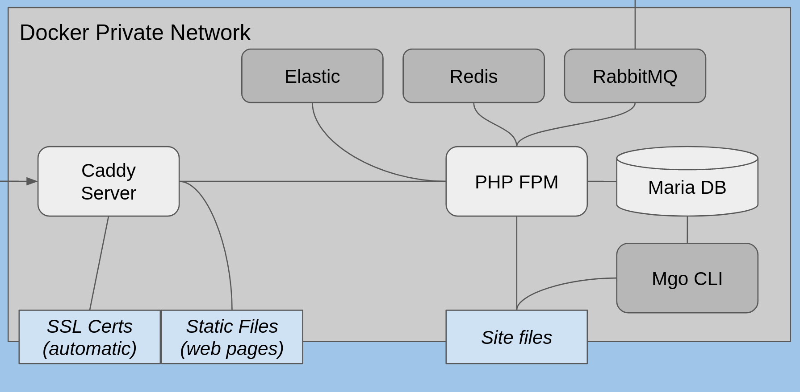

# Caddy V2 Based PHP Cloud
(for Magento 2, or anything else actually)

A collection of Docker images for running Magento 2 through [Caddy Server v2](https://caddyserver.com/)

## The Containers



Following are the `docker-compose` names:
* caddy - the web server, automatically providing TLS
* fpm - the PHP FastCGI Process Manager, doing all the PHP processing
* db - The Maria DB server
* redis - Cache mechanism
* elastic - container building an Elastic Search index for your site
* rabbitmq - message bus for async operations
* cli - your work horse for deployments, maintenance, cron jobs etc

## Setup

Clone this repository to your machine!

### TLDR; ###
If you want to create a simple local dev setup, add your Magento Composer credentials in `conf/composer.env` and go to [Install Magento](#install-magento)

### The Config Files ###

**Important 1**: Do not start the containers until the config is ready.

**Important 2**: The `conf` files should be untracked and are ignored by the .gitignore file to avoid commits with sensitive information. Please keep a backup of the files somewhere else! Also run following command: 
```bash
git update-index --assume-unchanged conf/*
```

First, go through the configuration. All files reside in the `conf` folder. 

```bash
    > ls conf
        basic_auth.conf
        caddy.env
        caddy_sensitive.env
        composer.env
        db.env
        global.env
        rabbitmq.env
```


### conf/caddy.env ###

If you are going to use this setup for local development (on your workstation), leave it as it is. If you are setting up a test server or server accessed from a public domain, do following changes:
* Change `SERVER_NAME` to your fully qualified domain name, if you have one. This is the name you must use to get the server to respond later on.
* Change the TLS mode. If this server has a public name and adress (i.e. you can reach it from the Internetz) set `TLS_MODE` to `tls_auto` and you will auto fetch a valid certificate. If you need another setup, read the comments in the `caddy.env` file.

### conf/caddy_sensitive.env ###
This file is only used if you use a DNS challenge for the certificate. If you do you know it and how to use it is documented in Caddy documentation and somewhat in the `caddy.env` file.

### conf/composer.env ###
Add your Magento tokens in `COMPOSER_MAGENTO_USERNAME` and `COMPOSER_MAGENTO_PASSWORD`.
If you have a Github account you can add a Github token as well to get access to dev repos. 

### conf/db.env ###
Set GOOD user names and passwords in `db.env`. Long and ugly! These settings are used to automatically create the database when then Maria DB container startup for the first time.

### conf/global.env ###
This file has Magento specific settings. What you MIGHT need to change:
- `MAGENTO_RUN_MODE` if changed to `development` compilation and deployment is disabled. The server will be slower but easier to work with when it comes to local dev as changes are visible immediately.
- `MAGENTO_COMPILE_THEME` - If you change to another or create your own theme, set the name here.
- `MAGENTO_COMPILE_LOCALES` - Set your locale here or multiple if you need more than one. Keep `en_US` as Admin use it as a fallback.

These settings are used by installation but alse the pre-made command scripts. If you want to run this setup smoothly, keep these updated.

### conf/basic_auth.conf ###
If you want to password protect your page you can uncomment the block in `basic_auth.conf` and if you want to make other URLs or similar protected you can configure this block as you want. It is a standard
Caddy `import file` directive in the Caddy config so anything goes. 
Make sure your setup works first before adding a password.
    
### Make the containers ###
In the root folder, execute:
```bash
docker-compose build
docker-compose up -d
```

You should now have a running server platform!

### Install Magento
Enter the CLI docker container. This is the main tool for you to work with the Magento site and there is a bash script to kickstart the command line:

```bash 
mgo-cli.sh
```
The site folder must be empty. Clean it and create the Composer project. Note that first time Composer is used the root user must be the one executing the command. If not there will be errors.

When requested, fill in the Magento Composer keys (created from Magento Marketplace).

```bash
rm -rf /srv/site/*

/usr/local/bin/composer create-project --repository-url=https://repo.magento.com/ magento/project-community-edition /srv/site

chown -R www-data:www-data /srv/site
```

From now on Composer should be executed as the `www-data` user (no more root!). This is happening automatically if you use the `composer` command which is an alias that also changes to the `www-data` user.
If you by mistake do any operation as root and files change owner, you will end up with some classical Magento behaviours like rapidly growing log files etc. Always use the aliased command or make sure to sudo to `www-data`.

Now, install Magento! Check all values in the command below and make sure the credentials are the same as the configuration files have. Then, execute!

```bash
magento setup:install \
--base-url=https://YOUR-SERVER-NAME-OR-localhost \
--db-host=db \
--db-name=sitedb \
--db-user=siteuser \
--db-password=sitepassword \
--admin-firstname=admin \
--admin-lastname=admin \
--admin-email=YOUR@EMAIL.COM \
--admin-user=admin \
--admin-password=admin123 \
--language=sv_SE \
--currency=SEK \
--timezone=Europe/Stockholm \
--use-rewrites=1 \
--amqp-host="rabbitmq" \
--amqp-port="5672" \
--amqp-user="magentorabbit" \
--amqp-password="passiwortivettu" \
--amqp-virtualhost="/"
```

When something similar to:
```bash
[SUCCESS]: Magento installation complete.
[SUCCESS]: Magento Admin URI: /admin_vs34fw
Nothing to import.
```
is in your console, you have Magento site! Remember the Admin URI, that really is the Admin URI.

This setup is running all messaging consumers with `supervisord` in the `cli` container. Unfortunately, the only way to disable the cron based consumers is to change the config manually. Open the file `site/app/etc/env.php` and add the following config:
```bash
    'cron_consumers_runner' => [
        'cron_run' => false
    ]
```
It doesn't matter where you put it but make sure there are commas before and after matching the rest of the config!

Let's do some installation cleanup and redeploy:
```bash
cd /srv/site
find var generated vendor pub/static pub/media app/etc -type f -exec chmod g+w {} +
find var generated vendor pub/static pub/media app/etc -type d -exec chmod g+ws {} +
chown -R :www-data .
chmod u+x bin/magento
/usr/local/bin/magento-redeploy
```

Last thing to do is to add the Elastic server:
```bash
magento config:set catalog/search/engine 'elasticsearch6'
magento config:set catalog/search/elasticsearch6_server_hostname 'elastic'
magento config:set catalog/search/elasticsearch6_server_port '9200'
magento config:set catalog/search/elasticsearch6_index_prefix 'magento2'
magento config:set catalog/search/elasticsearch6_enable_auth '0'
magento config:set catalog/search/elasticsearch6_server_timeout '15'
magento index:reindex
```

Congratulations, you can now test your site in a your favourite browser with `https://[servername]/`.

## Advanced Setup
This is not needed for a standard Magento setup!
You need to have Caddy config skills to configure this server stack for anything else than Magento. But if you do have the knowledge, you can override everything in `caddy/etc/Caddyfile` and make it suite your needs. You either restart the Caddy container or reload from within the container to get the updates. Check the docker-composer logs to see if the config is valid.

## CLI Usage

The main tool for working with the site is the CLI container. To start the CLI execute the `mgo-cli-sh` script.

**Important**: All commands executed should be made by the `www-data` user to avoid future Magento problems.

There are some prepared commands:
* `magento` - Provides a `www-data` user-safe wrapper around the `bin/magento` command
* `composer` - Provides a `www-data` user-safe wrapper around Composer
* `magento-redeploy` - Makes a complete full site re-deploy with the magento commands
    * upgrade
    * di:compile
    * static-content:deploy for Admin with the locales configured
    * static-content:deploy for Frontend with the theme and locales configured
    * cache:clean
    * indexer:reindex
* `magento-di-compile` - Makes a re-compile and cache re-init by
    * di:compile
    * cache:clean
    * cache:flush

## Scripts in Root Folder

There are some scripts in the project root as well for easier maintenance and day to day tasks.

* `mgo-redeploy.sh` - wrapper script for the redeploy command in the CLI container
* `mgo-di-compile.sh` - wrapper script for the compile command in the CLI container
* `mgo-backup.sh` - The MagePsycho backup script. Can be executed in many ways this is an example:

    `./mgo-backup.sh --src-dir=site --dest-dir=backups --type=code`
* `db-backup.sh` - Making a backup of the database, saved in `backups`
* `db-restore.sh` - Makes a restore from a db backup file in `backups` with the ISO date in file name as the parameter like:

     `./db-restore.sh 2018-06-01`
* topic_consumer.py - This is over the top. If don't know what it is, you don't need it. :)
